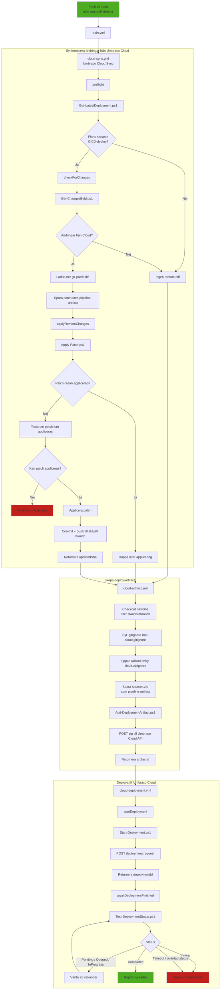

Centrala dataövergångar:

- latestDeploymentId hämtas från Cloud.
- remoteChanges avgör om en patch ska laddas ner och appliceras.
- updatedSha används för artifact-checkout efter synkronisering.
- artifactId används för att starta Cloud-deployen.
- deploymentId används för polling tills deployen är klar.

Manuell deploy kan även startas direkt via cloud-deployment.yml med ett befintligt artifactId.